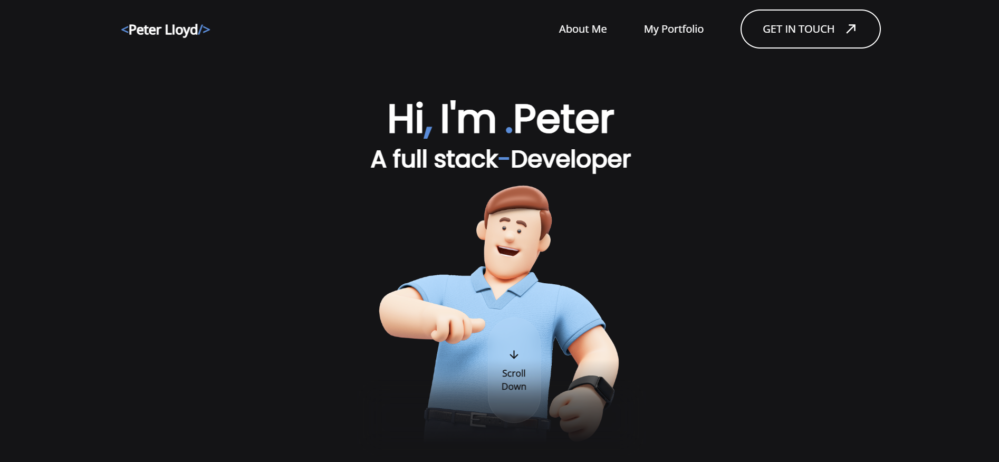

<div align="center">
  <h3 align="center">Portfolio template</h3>

  <p align="center">
    A simple portfolio template made in react & tailwind OR html & tailwind
    <br />
    <a href="https://3d-portfolio-beryl.vercel.app">View Demo</a>
    ·
    <a href="https://youtu.be/dZfTGpOufg0">Tutorial</a>
  </p>
</div>


<!-- ABOUT THE PROJECT -->
## About The Project


There are many great Portfolio templates available on GitHub; however, I didn't find one that really suited my needs so I created this enhanced one.

There are two versions:
* React + TailwindCSS
* HTML + TailwindCSS

But the coolest part there is also a figma file of the design and a custom 3D character that you customize and make the portfolio that more personal.


<!-- GETTING STARTED -->
## Getting Started

### 1. HTML & TailwindCSS

[See this video](https://youtu.be/dZfTGpOufg0?si=nQfjl-y6OePNoili) or follow the steps below:

You dont have to do anythig...its already finished, but if you want to customize the theme color
</br>
Make sure you have npm installed and then just do these:

  ```sh
  npm install 
  ```

  ```sh
  npm run watch
  ```

And start changing the theme hex color code.


### 2. React & TailwindCSS

[See this video](https://youtu.be/dZfTGpOufg0?si=nQfjl-y6OePNoili) or follow the steps below:

Make sure you have npm installed and then just do:

  ```sh
  npm install 
  ```

  ```sh
  npm run start
  ```

Yup.. thats pretty much it. 
<br>
Start customizing it and add your info and projects.

### 3. Figma 3D Character

Figma is free and you can customize the 3D character, but
To be honest [just watch this video](https://youtu.be/dZfTGpOufg0?si=5Zys0MLz5P9RFEcJ&t=202) its like 3 minutes and its easier that way.


